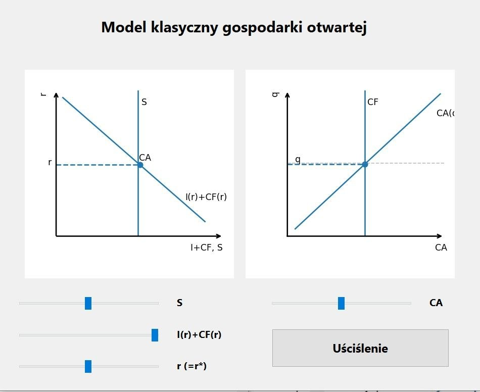
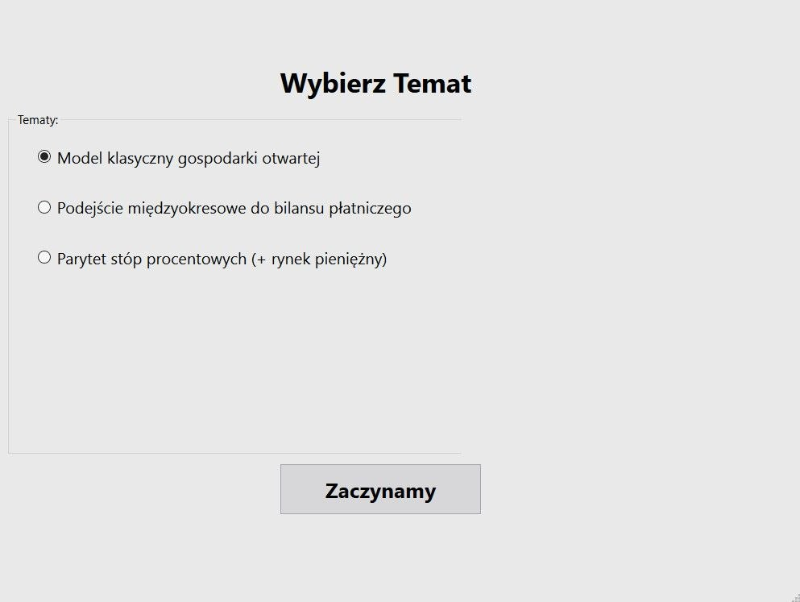

# 📊 Open Economy Models Simulator (PyQt6)

This project provides an interactive visualization of key macroeconomic mechanisms in an open economy framework.

Using a desktop application built with **PyQt6**, **Matplotlib**, and embedded **HTML rendering**, users can explore how changes in economic parameters affect equilibrium outcomes in real time.

---

## 📌 Current Models

The application currently implements two core macroeconomic frameworks within a **unified interface**:

### 1. Classical Open Economy Model  
*(Model klasyczny gospodarki otwartej)*

A graphical representation of the standard open economy model, integrating key relationships into one consistent visualization environment.

Users can analyze interactions between:

- Savings (**S**)
- Investment and capital flows (**I(r) + CF(r)**)
- Exogenous interest rate (**r = r\***)
- Capital flows (**CF**)
- Current account (**CA**)
- Real exchange rate (**q**)

---

### 2. Intertemporal Approach to the Balance of Payments  
*(Podejście międzyokresowe do bilansu płatniczego)*

A dynamic two-period model illustrating intertemporal consumption choices and external balance.

The visualization includes:

- Budget constraint:
  - slope: **−(1 + r)**
- Intertemporal consumption:
  - **C₁, C₂**
- Endowment points:
  - **Y₁, Y₂**
- Utility maximization:
  - **U = C₁^β · C₂^(1−β)**
- Equilibrium point (**Eₐ**)
- Intertemporal trade interpretation

Additionally, the model features:

- Approximate **Production Possibility Frontiers (PPF)**  
  modeled as smooth curves attached to the budget line
- Comparative statics via:
  - interest rate (**r**)
  - time preference (**β**)

---

## 📊 Visualizations

The application generates multiple interactive plots:

### Classical Model:
1. **Savings–Investment / Capital Flows Diagram**
   - relationship between savings and investment–capital flow schedule
   - equilibrium at **r = r\***
   - capital flows: **CF = S − I**

2. **Current Account and Real Exchange Rate Diagram**
   - **CA(q)** relationship
   - equilibrium exchange rate (**q\***)
   - shifts in current account

---

### Intertemporal Model:
3. **Intertemporal Consumption Diagram**
   - budget line and optimal consumption choice
   - utility curves
   - PPF (present / future orientation)
   - equilibrium adjustment

---

## 📸 Screenshots

### Intertemporal Model

### Classical Model

### Topic Selection Interface

---

## ⚙️ Key Features

- Interactive sliders for key parameters:
  - interest rate (**r**)
  - time preference (**β**)
- Real-time graph updates
- Automatic equilibrium calculation
- Multiple macroeconomic frameworks in one application
- Visualization of:
  - **S, I, CF**
  - **CA(q)**
  - **intertemporal consumption (C₁, C₂)**
  - **utility and equilibrium points**

---

## 🧠 Model Notes

- The models are simplified educational representations.
- Some parameter combinations may generate economically unrealistic values (e.g., negative *q*), which are intentionally allowed for visualization purposes.
- The identity **S − I = CF** is imposed.
- In the intertemporal model, **PPF curves are approximated using parametric functions attached to the budget line**.

---

## 🧾 UI & Rendering

- Graphs are rendered using **Matplotlib**
- Interface built with **PyQt6**
- Mathematical descriptions and model assumptions are displayed using **embedded HTML (QTextBrowser)**

---

## 🛠 Technologies

- Python
- PyQt6
- Matplotlib
- NumPy

---

## 📁 Project Structure
open-economy-models

│

├── main.py

├── ui/

│ ├── MainWindow.ui

│ ├── Classic.ui

│ ├── Bilans.ui

│ └── ...

├── screenshots/

│ ├── ...

├── requirements.txt

└── README.md

---

## 🚧 Future Development

This project is actively being developed. Planned extensions include:

- Interest Rate Parity *(Parytet stóp procentowych)*
- Mundell–Fleming Model
- Additional macroeconomic simulations
- Improved graphical accuracy of PPF curves
- UI/UX improvements

---

## 🎯 Purpose

The goal of this project is to:

- strengthen understanding of macroeconomic theory  
- build interactive economic simulations  
- develop practical programming skills in Python  
- create a high-quality project demonstrating the ability to combine economics and software development  

The project also serves as part of a personal portfolio for internships and entry-level roles in data analysis and finance.

---

## 👨‍💻 Author

**Arseniy Vanitskiy**  
University of Warsaw  
Economics & Mathematics  

---

## 📌 Status

🚧 Work in Progress — new models and features are continuously being added.
